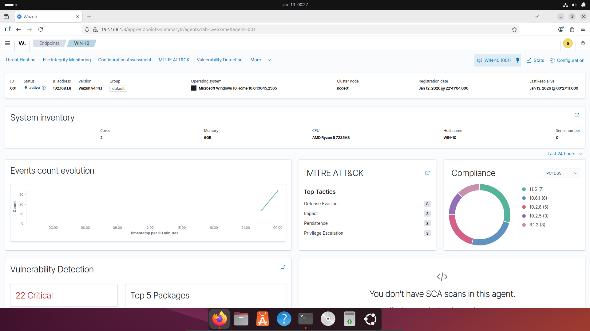
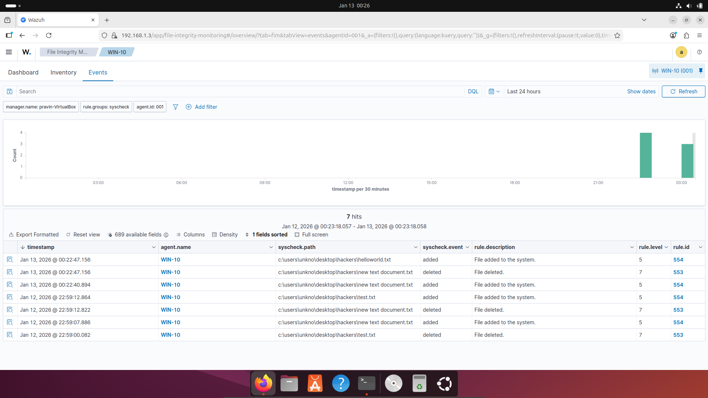
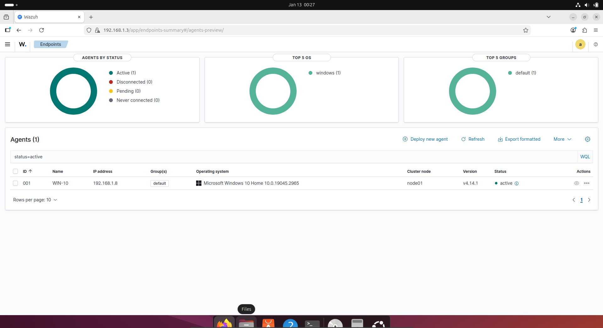

# Wazuh SIEM Home Lab Portfolio

## 🎯 Project Overview

This project demonstrates the deployment and configuration of Wazuh, an open-source SIEM platform, in a home lab environment. The setup includes centralized security monitoring, threat detection, and incident response capabilities.

## 🔗 Live Portfolio

**View the full portfolio**: [https://pravinthecoder.github.io/wazuh-siem-portfolio/](https://pravinthecoder.github.io/wazuh-siem-portfolio/)

## 🛠️ Technologies Used

- **SIEM Platform**: Wazuh 4.14.1
- **Virtualization**: Oracle VirtualBox
- **Operating Systems**: Ubuntu Desktop, Windows 10
- **Monitoring**: File Integrity Monitoring, Vulnerability Detection
- **Frameworks**: MITRE ATT&CK, PCI DSS

## 📊 Key Achievements

✅ Deployed enterprise-grade SIEM solution  
✅ Configured centralized security monitoring  
✅ Implemented File Integrity Monitoring with real-time alerting  
✅ Integrated MITRE ATT&CK framework  
✅ Enabled vulnerability detection (22 critical vulnerabilities identified)  
✅ Monitored 327 security events in 24 hours  

## 📸 Screenshots

### Agent Dashboard

### File Integrity Monitoring

### Endpoints Management

## 🎓 Skills Demonstrated

- SIEM Deployment & Configuration
- Security Event Analysis
- File Integrity Monitoring
- Vulnerability Management
- Log Analysis & Correlation
- Linux & Windows Administration

## 📫 Contact

- **LinkedIn**: [Linked-In-Profile](https://linkedin.com/in/pravin-s-575102252)
- **Email**: [Email](pravinthecoder2005@gmail.com)
- **Portfolio**: [Live Demo](https://pravinthecoder.github.io/wazuh-siem-portfolio/)
